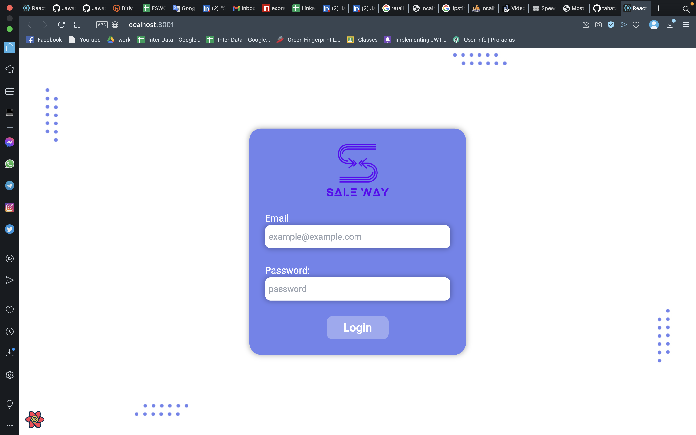
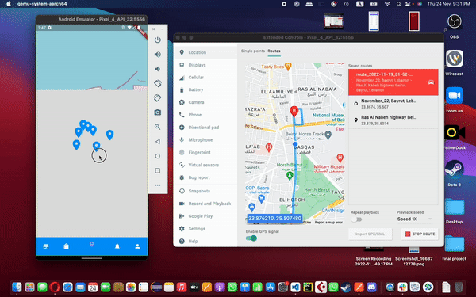

> Hello world! This is the project’s summary that describes the project plain and simple, limited to the space available.

**[PROJECT PHILOSOPHY](https://github.com/JawadElSayed/sale-way#-project-philosophy) • [WIREFRAMES](https://github.com/JawadElSayed/sale-way#-wireframes) • [TECH STACK](https://github.com/JawadElSayed/sale-way#-tech-stack) • [IMPLEMENTATION](https://github.com/JawadElSayed/sale-way#-impplementation) • [HOW TO RUN?](https://github.com/JawadElSayed/sale-way#-how-to-run)**

  

> The Sale Way app is a sale store locator and notification app that let you know the stores that make discounts add notifies you when passing a nearby store that makes discounts, in addition to a store and admin dashboard that display products, stores, user information, and some analytics about the interaction of users with the notifications.

### User Stories

-   As a user, I want to know about discounts, so that I can take the best price
-   As a user, I want to suffer discounted products, so that I can choose what suits me
-   As a user, I want to know nearby stores with discounts, so that I can visit them

  

### Store Manager Stories

-   As a store manager, I want people to know about my discounts, so that they come to the store
-   As a store manager, I want to display my discounted products, so that people can know about them

  

### Admin Stories

-   As an admin, I want to see the workflow of the app, so that I can improve my business
-   As an admin, I want to see the interaction of users with notifications, so that I can focus on important parts

  

> This design was planned before on paper, then moved to Figma app for the fine details.
> Note that i didn't use any styling library or theme, all from scratch and using pure css modules

| Landing                                  | Products Page                                 |
| ---------------------------------------- | --------------------------------------------- |
|  |  |

| Add/Edit Store                                          | Admin Analytics                                  |
| ------------------------------------------------------- | ------------------------------------------------ |
|  |  |

| User Login                             | User Stores Page                                   | Single Product                                      | Map page                           |
| -------------------------------------- | -------------------------------------------------- | --------------------------------------------------- | ---------------------------------- |
|  |  |  |  |

  

Here's a brief high-level overview of the tech stack the Well app uses:

-   This project uses the [Flutter app development framework](https://flutter.dev/). Flutter is a cross-platform hybrid app development platform which allows us to use a single codebase for apps on mobile, desktop, and the web.
-   To implement the dashboards, the app uses [React](https://reactjs.org). React makes it painless to create interactive UIs. Design simple views for each state in your application, and React will efficiently update and render just the right components when your data changes.
-   For persistent storage (database), the app uses the [Prisma](https://www.prisma.io) package which allows the app to create a custom storage schema and save it to the database (MySQL) in this case.
-   To send local push notifications, the app uses the [Firebase Cloud Messaging](https://firebase.google.com/docs/cloud-messaging) package which supports Android, iOS.
-   To add maps, the app uses [Google Maps](https://developers.google.com/maps) package which allows the app to get locations and mark places on the map
-   The app uses the font ["Roboto"](https://fonts.google.com/specimen/Roboto) as its main font, and the design of the app adheres to the material design guidelines.

  

> Uing the above mentioned tecch stacks and the wireframes build with figma from the user sotries we have, the implementation of the app is shown as below, these are screenshots from the real app

| Landing                                   | Products Page                                      |
| ----------------------------------------- | -------------------------------------------------- | --------------------------------------------------- | ------------------------------------------------ |
|      |              |
| Store page                                | Add/Edit Store                                     |
| ------------                              | ------------------                                 |
|          |           |
| Analytics page                            | Map Page                                           |
| ------------                              | ------------------                                 |
|  |                 |
| User Login/Signup                         | User Stores Page                                   | User Map page                                       | Notification page                                |
| --------------------------------------    | -------------------------------------------------- | --------------------------------------------------- | ----------------------------------               |
|   |       |         |  |
| Map page                                  | profile                                            |
| ------------                              | ------------------                                 |
|         |          |
